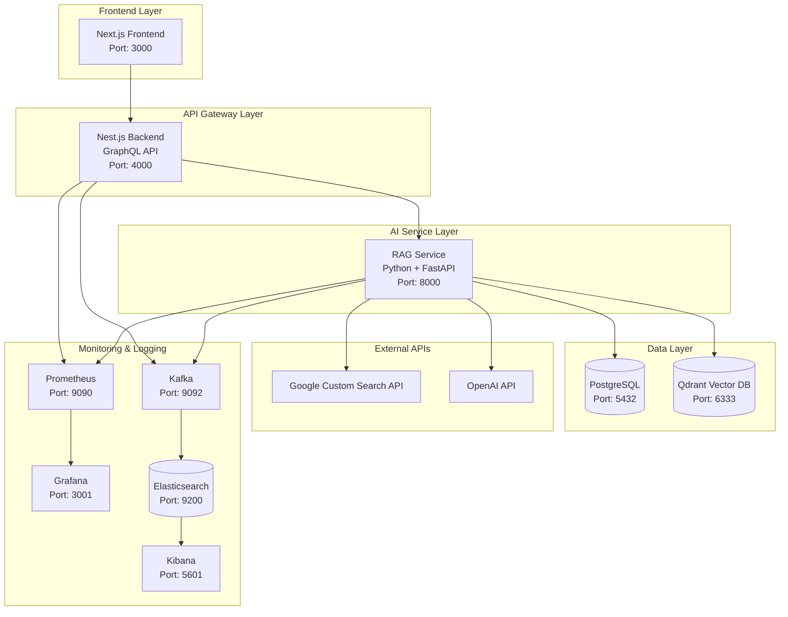

# 🚀 WebSearch RAG Bot 개발 가이드

## 📋 목차
1. [프로젝트 개요](#프로젝트-개요)
2. [시스템 아키텍처](#시스템-아키텍처)
3. [기술 스택](#기술-스택)
4. [개발 환경 설정](#개발-환경-설정)
5. [서비스별 개발 가이드](#서비스별-개발-가이드)
6. [API 문서](#api-문서)
7. [데이터베이스 스키마](#데이터베이스-스키마)
8. [배포 및 운영](#배포-및-운영)
9. [모니터링 및 로깅](#모니터링-및-로깅)
10. [문제 해결](#문제-해결)

---

## 🎯 프로젝트 개요

WebSearch RAG Bot은 **검색 기반 대화형 챗봇 시스템**으로, 다음과 같은 핵심 기능을 제공합니다:

### ✨ 주요 기능
- 🔍 **웹 검색 기반 RAG**: Google Custom Search API를 통한 실시간 정보 검색
- 💬 **이중 모드 대화**: 구조화된 분석 vs 자연스러운 대화
- 🧠 **메모리 시스템**: 단기/장기 기억을 통한 맥락 유지
- 📊 **벡터 검색**: Qdrant를 활용한 의미 기반 정보 검색
- 🎨 **모던 UI**: Next.js + Tailwind CSS 기반 반응형 인터페이스
- 📈 **실시간 모니터링**: Grafana + Prometheus 기반 시스템 모니터링

### 🎮 사용자 경험
- **구조화된 답변 모드**: 정보 검색, 분석, 연구용
- **자연스러운 대화 모드**: 일상 대화, 감정적 소통용

---

## 🏗️ 시스템 아키텍처



---

## 🛠️ 기술 스택

### Frontend
- **Next.js 14**: React 프레임워크
- **React 18**: UI 라이브러리
- **Apollo Client**: GraphQL 클라이언트
- **Tailwind CSS**: 스타일링
- **TypeScript**: 타입 안전성

### Backend
- **Nest.js**: Node.js 프레임워크
- **GraphQL**: API 쿼리 언어
- **TypeORM**: ORM
- **PostgreSQL**: 관계형 데이터베이스

### RAG Service
- **Python 3.11+**: 프로그래밍 언어
- **FastAPI**: 웹 프레임워크
- **LangChain**: LLM 프레임워크
- **Qdrant**: 벡터 데이터베이스
- **OpenAI API**: LLM 서비스

### Infrastructure
- **Docker & Docker Compose**: 컨테이너화
- **Kafka**: 메시지 스트리밍
- **Elasticsearch**: 로그 저장
- **Prometheus**: 메트릭 수집
- **Grafana**: 시각화

---

## ⚙️ 개발 환경 설정

### 1. 사전 요구사항
```bash
# 필수 소프트웨어
- Docker & Docker Compose
- Git
- Node.js 18+ (로컬 개발용)
- Python 3.11+ (로컬 개발용)
```

### 2. 프로젝트 클론
```bash
git clone <repository-url>
cd websearch-rag-bot
```

### 3. 환경 변수 설정

#### Backend 환경 변수
```bash
cp backend/env.example backend/.env
```

#### Frontend 환경 변수
```bash
cp frontend/env.example frontend/.env.local
```

#### RAG Service 환경 변수
```bash
cp rag-service/env.example rag-service/.env
```

**중요**: RAG Service의 `.env` 파일에서 다음 API 키들을 설정해야 합니다:
```env
OPENAI_API_KEY=your_openai_api_key_here
GOOGLE_API_KEY=your_google_api_key_here
GOOGLE_CSE_ID=your_google_custom_search_engine_id_here
```

### 4. 시스템 시작
```bash
# 전체 시스템 시작 (권장)
./start.sh

# 또는 수동으로 시작
docker-compose up -d
```

### 5. 서비스 확인
```bash
# 서비스 상태 확인
docker-compose ps

# 로그 확인
docker-compose logs -f [service-name]
```

---

## 🔧 서비스별 개발 가이드

### Frontend (Next.js)

#### 프로젝트 구조
```
frontend/
├── app/                    # Next.js App Router
│   ├── globals.css        # 전역 스타일
│   ├── layout.tsx         # 루트 레이아웃
│   └── page.tsx           # 메인 페이지
├── components/            # React 컴포넌트
│   ├── ApolloProvider.tsx # GraphQL 클라이언트
│   ├── ChatInterface.tsx  # 채팅 인터페이스
│   ├── Header.tsx         # 헤더 컴포넌트
│   ├── MessageInput.tsx   # 메시지 입력
│   ├── MessageList.tsx    # 메시지 목록
│   └── Sidebar.tsx        # 사이드바
├── lib/
│   └── graphql.ts         # GraphQL 쿼리/뮤테이션
└── package.json
```

#### 주요 컴포넌트

**ChatInterface.tsx**
- 메인 채팅 인터페이스
- 구조화된 답변 토글 처리
- GraphQL 뮤테이션 호출

**MessageInput.tsx**
- 메시지 입력 및 토글 UI
- 웹 검색/구조화된 답변 모드 선택

#### 개발 명령어
```bash
cd frontend

# 의존성 설치
npm install

# 개발 서버 시작
npm run dev

# 빌드
npm run build

# 프로덕션 서버
npm start
```

### Backend (Nest.js + GraphQL)

#### 프로젝트 구조
```
backend/
├── src/
│   ├── app.module.ts      # 루트 모듈
│   ├── main.ts           # 애플리케이션 진입점
│   ├── chat/             # 채팅 모듈
│   │   ├── chat.entity.ts    # 데이터베이스 엔티티
│   │   ├── chat.module.ts    # 모듈 정의
│   │   ├── chat.resolver.ts  # GraphQL 리졸버
│   │   └── chat.service.ts   # 비즈니스 로직
│   ├── database/         # 데이터베이스 모듈
│   └── logging/          # 로깅 모듈
└── package.json
```

#### 주요 기능

**ChatService**
- RAG 서비스와의 통신
- 구조화된 답변 vs 대화형 모드 라우팅
- 대화 히스토리 관리

**ChatResolver**
- GraphQL 스키마 정의
- 실시간 구독 지원

#### 개발 명령어
```bash
cd backend

# 의존성 설치
npm install

# 개발 서버 시작
npm run start:dev

# 빌드
npm run build

# 프로덕션 서버
npm run start:prod
```

### RAG Service (Python + FastAPI)

#### 프로젝트 구조
```
rag-service/
├── main.py               # FastAPI 애플리케이션
├── requirements.txt      # Python 의존성
├── services/
│   ├── __init__.py
│   ├── rag_service.py    # 메인 RAG 로직
│   ├── web_search.py     # 웹 검색 서비스
│   ├── vector_store.py   # 벡터 데이터베이스
│   └── logging_service.py # 로깅 서비스
└── Dockerfile
```

#### 주요 서비스

**RAGService**
- `generate_topic_based_response()`: 구조화된 답변 생성
- `chat_with_memory()`: 메모리 기반 대화형 챗봇
- 벡터 데이터베이스 관리

**WebSearchService**
- Google Custom Search API 통합
- 쿼리 분류 및 최적화
- 검색 결과 처리

#### 개발 명령어
```bash
cd rag-service

# 가상환경 생성
python -m venv venv
source venv/bin/activate  # Windows: venv\Scripts\activate

# 의존성 설치
pip install -r requirements.txt

# 개발 서버 시작
uvicorn main:app --reload --host 0.0.0.0 --port 8000
```

---

## 📚 API 문서

### GraphQL API (Backend)

#### 주요 쿼리/뮤테이션

**대화 생성**
```graphql
mutation {
  createConversation(title: "새 대화") {
    id
    title
    createdAt
  }
}
```

**메시지 전송**
```graphql
mutation {
  sendMessage(
    conversationId: "uuid"
    content: "안녕하세요!"
    useWebSearch: true
    useStructuredResponse: false
  ) {
    id
    content
    role
    sources
    contextInfo {
      shortTermMemory
      longTermMemory
      webSearch
    }
  }
}
```

**대화 목록 조회**
```graphql
query {
  conversations {
    id
    title
    updatedAt
  }
}
```

### REST API (RAG Service)

#### 엔드포인트

**구조화된 답변**
```http
POST /chat/structured
Content-Type: application/json

{
  "message": "인공지능에 대해 알려주세요",
  "conversation_id": "uuid",
  "use_web_search": true
}
```

**대화형 챗봇**
```http
POST /chat/conversational
Content-Type: application/json

{
  "message": "안녕하세요!",
  "conversation_id": "uuid"
}
```

**웹 검색**
```http
POST /search
Content-Type: application/json

{
  "query": "검색어",
  "max_results": 10
}
```

---

## 🗄️ 데이터베이스 스키마

### PostgreSQL (Backend)

#### Conversations 테이블
```sql
CREATE TABLE conversations (
  id UUID PRIMARY KEY DEFAULT gen_random_uuid(),
  title VARCHAR(255) NOT NULL,
  created_at TIMESTAMP DEFAULT CURRENT_TIMESTAMP,
  updated_at TIMESTAMP DEFAULT CURRENT_TIMESTAMP
);
```

#### Messages 테이블
```sql
CREATE TABLE messages (
  id UUID PRIMARY KEY DEFAULT gen_random_uuid(),
  conversation_id UUID REFERENCES conversations(id),
  content TEXT NOT NULL,
  role VARCHAR(20) NOT NULL CHECK (role IN ('user', 'assistant')),
  sources TEXT[],
  created_at TIMESTAMP DEFAULT CURRENT_TIMESTAMP
);
```

### Qdrant (Vector Database)

#### 컬렉션 구조
- **short_term_memory_{conversation_id}**: 단기 기억
- **long_term_memory_{conversation_id}**: 장기 기억
- **search_results_{conversation_id}**: 검색 결과

#### 벡터 스키마
```python
{
  "content": str,      # 텍스트 내용
  "metadata": {
    "source": str,     # 소스 URL
    "timestamp": str,  # 생성 시간
    "type": str        # 문서 타입
  }
}
```

---

## 🚀 배포 및 운영

### Docker 배포

#### 전체 시스템 배포
```bash
# 프로덕션 빌드
docker-compose -f docker-compose.prod.yml up -d

# 로그 확인
docker-compose logs -f

# 서비스 재시작
docker-compose restart [service-name]
```

#### 개별 서비스 배포
```bash
# 특정 서비스만 재빌드
docker-compose build [service-name]
docker-compose up -d [service-name]
```

### 환경별 설정

#### 개발 환경
```bash
# 로컬 개발
docker-compose up -d

# 핫 리로드 활성화
docker-compose -f docker-compose.dev.yml up -d
```

#### 프로덕션 환경
```bash
# 프로덕션 설정
docker-compose -f docker-compose.prod.yml up -d

# SSL/HTTPS 설정 필요
# 도메인 설정 필요
# 백업 전략 수립 필요
```

---

## 📊 모니터링 및 로깅

### Grafana 대시보드

#### 접속 정보
- **URL**: http://localhost:3001
- **계정**: admin/admin

#### 주요 대시보드
1. **시스템 개요**: 전체 시스템 성능 및 상태
2. **로그 분석**: 실시간 로그 분석 및 검색

### Prometheus 메트릭

#### 주요 메트릭
- HTTP 요청 수/응답 시간
- 데이터베이스 연결 상태
- 메모리/CPU 사용률
- 에러율

### 로그 시스템

#### 로그 타입
- **Application**: 애플리케이션 이벤트
- **Error**: 에러 및 예외
- **Performance**: 성능 메트릭
- **Request**: HTTP 요청/응답
- **GraphQL**: GraphQL 작업

#### 로그 확인
```bash
# 전체 로그
docker-compose logs -f

# 특정 서비스 로그
docker-compose logs -f backend
docker-compose logs -f rag-service
docker-compose logs -f frontend

# 실시간 로그 필터링
docker-compose logs -f | grep ERROR
```

---

## 🔧 문제 해결

### 일반적인 문제

#### 1. 서비스 시작 실패
```bash
# 컨테이너 상태 확인
docker-compose ps

# 로그 확인
docker-compose logs [service-name]

# 컨테이너 재시작
docker-compose restart [service-name]
```

#### 2. 데이터베이스 연결 오류
```bash
# PostgreSQL 상태 확인
docker-compose exec postgres pg_isready -U postgres

# Qdrant 상태 확인
curl http://localhost:6333/collections
```

#### 3. API 키 오류
```bash
# RAG Service 환경 변수 확인
docker-compose exec rag-service env | grep API_KEY

# .env 파일 확인
cat rag-service/.env
```

#### 4. 포트 충돌
```bash
# 포트 사용 확인
netstat -tulpn | grep :3000
netstat -tulpn | grep :4000
netstat -tulpn | grep :8000

# docker-compose.yml에서 포트 변경
```

### 성능 최적화

#### 1. 메모리 사용량 최적화
```yaml
# docker-compose.yml
services:
  rag-service:
    deploy:
      resources:
        limits:
          memory: 2G
        reservations:
          memory: 1G
```

#### 2. 데이터베이스 최적화
```sql
-- 인덱스 생성
CREATE INDEX idx_messages_conversation_id ON messages(conversation_id);
CREATE INDEX idx_messages_created_at ON messages(created_at);
```

#### 3. 벡터 데이터베이스 최적화
```python
# Qdrant 설정 최적화
collection_config = {
    "vectors": {
        "size": 1536,  # OpenAI embedding 차원
        "distance": "Cosine"
    },
    "optimizers_config": {
        "default_segment_number": 2
    }
}
```

### 디버깅 팁

#### 1. 로그 레벨 조정
```python
# RAG Service
import logging
logging.basicConfig(level=logging.DEBUG)
```

#### 2. GraphQL 쿼리 디버깅
```bash
# GraphQL Playground 접속
http://localhost:4000/graphql
```

#### 3. API 테스트
```bash
# RAG Service API 테스트
curl -X POST "http://localhost:8000/health"

# Backend GraphQL 테스트
curl -X POST "http://localhost:4000/graphql" \
  -H "Content-Type: application/json" \
  -d '{"query": "{ __schema { types { name } } }"}'
```

---

## 📞 지원 및 기여

### 개발 워크플로우
1. 이슈 생성
2. 브랜치 생성 (`git checkout -b feature/amazing-feature`)
3. 변경사항 커밋 (`git commit -m 'Add amazing feature'`)
4. 브랜치 푸시 (`git push origin feature/amazing-feature`)
5. Pull Request 생성

### 코드 스타일
- **Frontend**: ESLint + Prettier
- **Backend**: Nest.js 스타일 가이드
- **Python**: PEP 8 + Black

### 테스트
```bash
# Frontend 테스트
cd frontend && npm test

# Backend 테스트
cd backend && npm test

# RAG Service 테스트
cd rag-service && python -m pytest
```

---

## 📝 라이선스

이 프로젝트는 MIT 라이선스 하에 배포됩니다.

---

## 🎉 마무리

이 개발 가이드를 통해 WebSearch RAG Bot 시스템을 효과적으로 개발하고 운영할 수 있습니다. 

추가 질문이나 문제가 있으시면 언제든지 이슈를 생성해 주세요!

**Happy Coding! 🚀**
